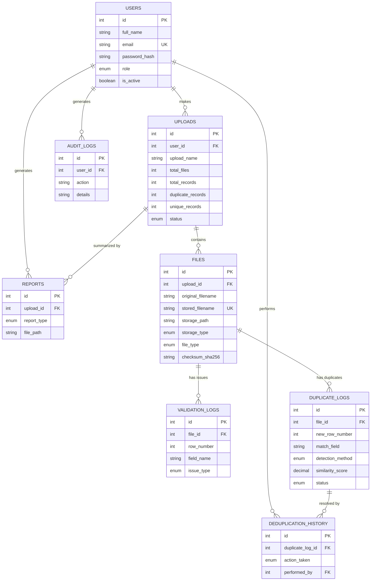

# Database Design

## Entity-Relationship Diagram

## Why this shape?

**One upload -> many files -> many validation/duplicate rows.** A user might drag-and-drop
5 CSVs at once. We don't want to re-ask "which user uploaded this?" on every single file row,
so that fact lives once, on `uploads`, and everything else hangs off it. This is what
**3rd Normal Form (3NF)** means in practice: every column in a table depends on that table's
primary key, the whole key, and nothing else.

**Why `duplicate_logs` is separate from `validation_logs`.** They answer different questions:
validation asks "is this row well-formed?" (missing email, bad phone format), duplication asks
"have I seen this data before?". Keeping them apart means each table stays small, fast to query,
and easy to reason about — you can generate a "validation report" or a "duplicate report"
independently.

**Why `deduplication_history` is separate from `duplicate_logs`.** `duplicate_logs.status`
tells you the *current* state of a duplicate (pending/merged/ignored/...). But if an admin
later asks "who deleted this record and when?", you need history, not just current state.
Splitting "current state" from "history of changes" is a common and important pattern —
it's the same idea behind audit trails in banking and healthcare systems.

## Indexes — why these specifically

| Table | Index | Reason |
|---|---|---|
| users | `email` | Every login looks up by email — without an index this becomes a full table scan as users grow |
| uploads | `user_id`, `created_at` | Dashboard queries are always "this user's uploads, newest first" |
| files | `checksum_sha256` | Lets us answer "has this exact file been uploaded before?" in O(1) instead of scanning file contents |
| duplicate_logs | `status` | The UI constantly filters "show me only *pending* duplicates" |
| audit_logs | `user_id`, `created_at` | Security audits query "what did user X do, and when?" |

## Normalization note

We stop at 3NF (not push to BCNF/4NF) deliberately — this is a **practical engineering
tradeoff**. Going further would split tables in ways that require more JOINs for the
dashboard's most common queries, hurting read performance for very little real-world benefit
here, since we have no columns that violate BCNF in this schema.
