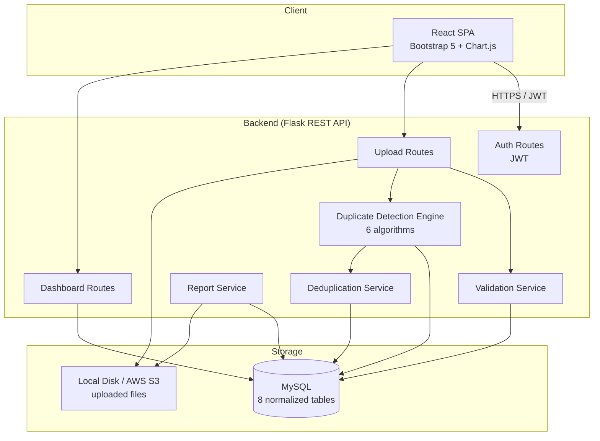
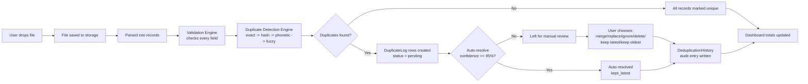
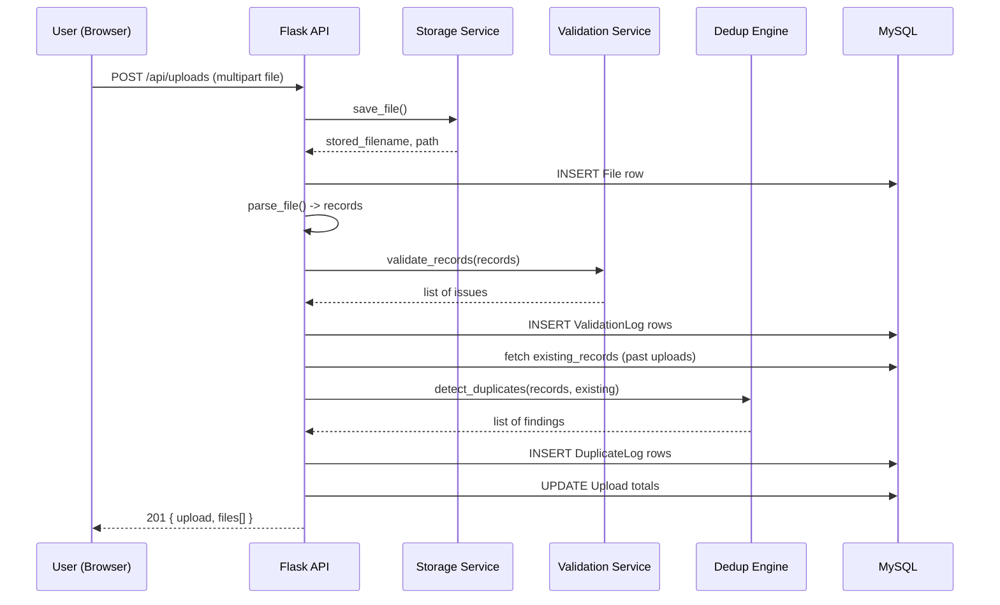
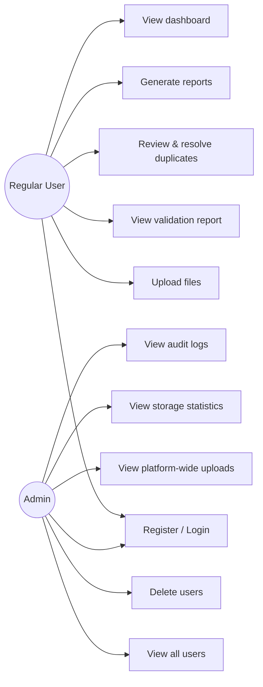

# Diagrams

## Architecture Diagram

```mermaid
graph TB
    subgraph Client
        A[React SPA<br/>Bootstrap 5 + Chart.js]
    end

    subgraph "Backend (Flask REST API)"
        B[Auth Routes<br/>JWT]
        C[Upload Routes]
        D[Validation Service]
        E[Duplicate Detection Engine<br/>6 algorithms]
        F[Deduplication Service]
        G[Report Service]
        H[Dashboard Routes]
    end

    subgraph Storage
        I[(MySQL<br/>8 normalized tables)]
        J[Local Disk / AWS S3<br/>uploaded files]
    end

    A -->|HTTPS / JWT| B
    A --> C
    A --> H
    C --> D
    C --> E
    D --> I
    E --> I
    E --> F
    F --> I
    C --> J
    G --> I
    G --> J
    H --> I
```

## Workflow Diagram — Upload to Resolution

```mermaid
flowchart LR
    A[User drops file] --> B[File saved to storage]
    B --> C[Parsed into records]
    C --> D[Validation Engine<br/>checks every field]
    D --> E[Duplicate Detection Engine<br/>exact -> hash -> phonetic -> fuzzy]
    E --> F{Duplicates found?}
    F -->|No| G[All records marked unique]
    F -->|Yes| H[DuplicateLog rows created<br/>status = pending]
    H --> I{Auto-resolve<br/>confidence >= 95%?}
    I -->|Yes| J[Auto-resolved<br/>kept_latest]
    I -->|No| K[Left for manual review]
    K --> L[User chooses:<br/>merge/replace/ignore/delete/<br/>keep latest/keep oldest]
    L --> M[DeduplicationHistory<br/>audit entry written]
    J --> M
    G --> N[Dashboard totals updated]
    M --> N
```

## Sequence Diagram — Single File Upload

```mermaid
sequenceDiagram
    participant U as User (Browser)
    participant API as Flask API
    participant St as Storage Service
    participant V as Validation Service
    participant Dd as Dedup Engine
    participant DB as MySQL

    U->>API: POST /api/uploads (multipart file)
    API->>St: save_file()
    St-->>API: stored_filename, path
    API->>DB: INSERT File row
    API->>API: parse_file() -> records
    API->>V: validate_records(records)
    V-->>API: list of issues
    API->>DB: INSERT ValidationLog rows
    API->>DB: fetch existing_records (past uploads)
    API->>Dd: detect_duplicates(records, existing)
    Dd-->>API: list of findings
    API->>DB: INSERT DuplicateLog rows
    API->>DB: UPDATE Upload totals
    API-->>U: 201 { upload, files[] }
```

## Use Case Diagram

```mermaid
graph LR
    User((Regular User))
    Admin((Admin))

    User --> UC1[Register / Login]
    User --> UC2[Upload files]
    User --> UC3[View validation report]
    User --> UC4[Review & resolve duplicates]
    User --> UC5[Generate reports]
    User --> UC6[View dashboard]

    Admin --> UC1
    Admin --> UC7[View all users]
    Admin --> UC8[Delete users]
    Admin --> UC9[View platform-wide uploads]
    Admin --> UC10[View storage statistics]
    Admin --> UC11[View audit logs]
```
